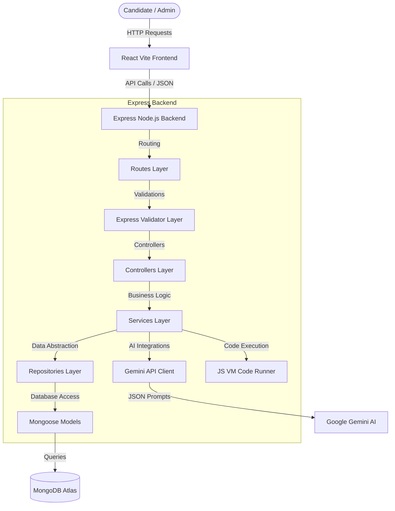

# InterviewIQ – AI-Powered Technical Assessment & Interview Intelligence Platform

InterviewIQ is an enterprise-grade SaaS web application designed to help software engineers prepare for technical interviews. The platform incorporates automated ATS resume feedback, active AI-generated mock interviews, custom-timed assessments, code playgrounds with sandboxed execution runtimes, and progress charts.

---

## 🏗️ Architectural Core Concepts

InterviewIQ is built using clean code architecture principles, separating user routing, request checking, business logic rules, and database operations.



### 1. Model-View-Controller (MVC) Pattern
We use the **MVC pattern** to define clear separation of concerns:
*   **Models**: Mongoose schemas located in `src/models/` enforce data constraints, validate fields, and contain pre-save hooks (like password hashing via `bcrypt`).
*   **Views (API JSON Responses)**: Handled dynamically by Express controllers, returning formatted responses with standardized HTTP status codes.
*   **Controllers**: Located in `src/controllers/`, they map API requests, invoke business services, and forward results to the client.

### 2. Service Layer Pattern
All core business logic (Gemini prompt construction, document file parsing, coding evaluations, study roadmap generation) is isolated in the **Service Layer** (`src/services/`). This keeps controllers slim, testable, and completely detached from specific database APIs or AI dependencies.

### 3. Repository Pattern
To isolate database interactions, we use the **Repository Pattern** (`src/repositories/`). Services do not write direct Mongoose queries (e.g. `User.find()`). Instead, they call abstract repositories. This enables decoupling from Mongoose, making it easy to swap MongoDB for SQL, PostgreSQL, or mock repositories during unit testing.

---

## 🛡️ Enterprise Security Implementations

InterviewIQ implements multiple security controls to guarantee production-ready platform security:

1.  **Stateful Token Rotation (JWT Access & Refresh Tokens)**:
    *   **Access Token**: Short-lived (15 minutes), passed inside the HTTP `Authorization: Bearer <token>` header, used to authenticate protected endpoints.
    *   **Refresh Token**: Long-lived (7 days), stored in local storage, passed to `/api/auth/refresh` to fetch a new access token once expired. This prevents long-lived exposure of credentials.
2.  **Request Throttling (Rate Limiting)**:
    *   General API endpoints are restricted to `200` requests per 15 minutes.
    *   Authentication endpoints (`/login`, `/register`, `/forgot-password`) are strictly restricted to `20` attempts per 15 minutes to block brute-force attacks.
3.  **Content Security Headers (Helmet)**:
    *   Protects against Cross-Site Scripting (XSS), Clickjacking, MIME-sniffing, and eavesdropping by enforcing secure HTTP headers.
4.  **CORS (Cross-Origin Resource Sharing)**:
    *   Strictly filters incoming request origins, protecting backend routes from malicious cross-origin script executions.
5.  **Input Validation & Sanitization**:
    *   `express-validator` filters and sanitizes request payloads, blocking NoSQL injections and XSS vectors.

---

## 🤖 Gemini AI Integration & Model Fallback

InterviewIQ isolates all AI operations within the generative client `src/ai/gemini.client.js` and service `src/services/gemini.service.js`.

### 1. Self-Healing Model Fallback
To prevent runtime failures if specific Gemini models are unavailable on your API key tier or region (which throws `404 Not Found`), the client implements an **automatic fallback chain**:
1.  Attempts the model configured in `.env` (`GEMINI_MODEL`).
2.  Falls back to `gemini-3.5-flash` (latest preview).
3.  Falls back to `gemini-2.5-flash` (latest stable).
4.  Falls back to `gemini-2.0-flash`.
5.  Falls back to legacy `gemini-pro`.
*This makes the AI layer highly resilient and self-healing.*

### 2. JSON Schema Enforcement
We configure the Gemini model client with `responseMimeType: 'application/json'` to guarantee that the model output conforms strictly to our JSON schemas, preventing parsing crashes on the server.

---

## 💻 Sandboxed JS VM Code Execution Engine

To run user code submissions securely without setting up massive third-party sandbox clusters, InterviewIQ incorporates a lightweight execution sandbox inside `src/utils/codeRunner.js` using Node.js's built-in `vm` module.

### How it works:
1.  **Context Isolation**: The user code is loaded into an isolated context (`vm.createContext()`) where they have no access to the global scope, local system files, environment variables, or Node's `require`/`process`.
2.  **Automated Wrapper**: Based on the challenge title, the code runner injects an wrapper that parses input test parameters, runs the function, and serializes the result:
    ```javascript
    // Two Sum Wrapper Example
    const lines = "2,7,11,15\n9".split('\n');
    const nums = lines[0].split(',').map(Number);
    const target = Number(lines[1]);
    result = twoSum(nums, target).sort().join(',');
    ```
3.  **Infinite Loop Protection (Timeout)**: The script execution is restricted with a `2000ms` timeout limit. If the student writes an infinite loop, the VM halts execution immediately, preventing CPU exhaustion.

---

## 🗄️ Database Schema & Optimization Indices

### 1. `User` Schema
Tracks profiles, email verifications, and platform permissions.
*   **Optimization**: Unique index on `email` to speed up logins.

### 2. `Resume` Schema
Stores parsed ATS scores, strengths, weaknesses, and keyword recommendations.
*   **Optimization**: Compound index on `{ userId: 1, createdAt: -1 }` for instant retrieval of latest uploads.

### 3. `Interview` Schema
Tracks the turn-by-turn state machine of active mock interviews.
*   **Optimization**: Index on `userId` to fast-track analytics aggregation queries.

### 4. `Question` (MCQ) Schema
Stores multiple-choice questions.
*   **Optimization**: Indices on `difficulty` and `topics` to speed up custom test generation.

### 5. `CodingChallenge` Schema
Contains problem statements, starter codes, and public/hidden test cases.
*   **Optimization**: Unique index on `title`.

---

## 📡 API Reference Documentation

### 🔐 Authentication (`/api/auth`)
*   `POST /register`: Registers a candidate.
*   `POST /login`: Logs in a user. Returns JWT credentials.
*   `POST /refresh`: Rotates access tokens.
*   `GET /verify-email?token=<token>`: Activates candidate account.
*   `POST /forgot-password`: Dispatches a recovery link.
*   `POST /reset-password?token=<token>`: Sets a new password.

### 👤 Candidate Profiles (`/api/users`)
*   `GET /dashboard-metrics`: Aggregates activity counters and weekly study milestones.
*   `PUT /profile`: Modifies name, email, and password.

### 📄 Resume Reviews (`/api/resume`)
*   `POST /upload`: Expects `multipart/form-data` with `resume` file. Returns ATS report.
*   `GET /history`: Returns past resume grades.
*   `GET /latest`: Fetches the most recent resume analysis.

### 🎙️ AI Mock Interview (`/api/interviews`)
*   `POST /generate`: Begins a session. Expects `{ role, experienceLevel, techStack, difficulty }`.
*   `POST /:id/answer`: Evaluates the current question response and returns the next question.
*   `GET /history`: Lists past completed mock interviews.

### 🏆 Assessments & Practice (`/api/assessments`, `/api/coding`)
*   `GET /api/assessments/list`: Retrieves MCQ and coding test modules.
*   `POST /api/assessments/:id/submit`: Scores a timed test.
*   `GET /api/coding/challenges`: Lists category practice problems.
*   `POST /api/coding/submit/:id`: Runs user code in the VM sandbox.
*   `POST /api/coding/hint/:id`: Fetches AI logic coaching clues.

---

## 🐳 Docker Local Run

Spin up the entire application locally with a single command:
```bash
docker-compose up --build
```
*   **Frontend Web App**: `http://localhost` (Port 80)
*   **Backend Server API**: `http://localhost:5000`
*   **MongoDB Local Instance**: `http://localhost:27017`
